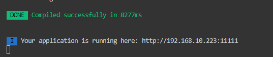
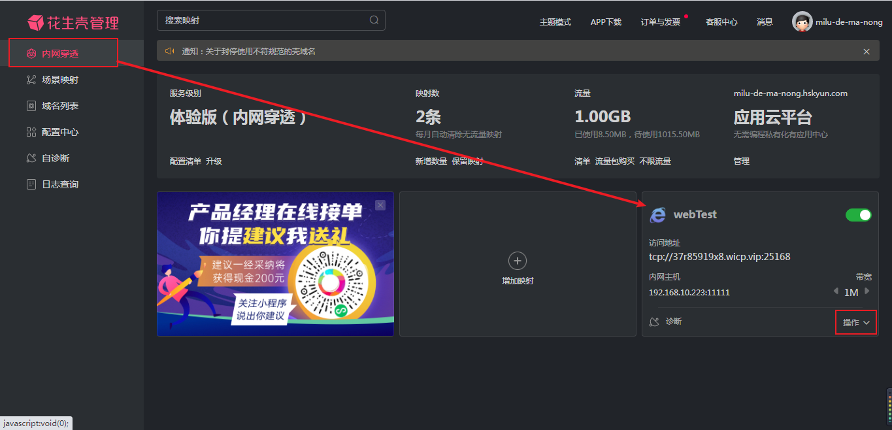
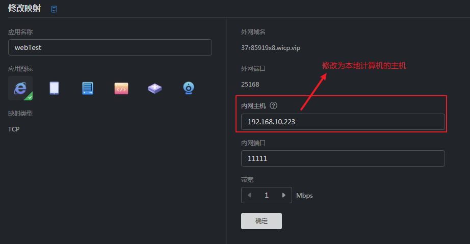

# new-sales-platform-small-procedure

> this is a demo with visual implement to create H5's page 

## Build Setup

``` bash
# install dependencies
npm install

# serve with hot reload at localhost:8080
npm run dev

# build for production with minification
npm run build

# build for production and view the bundle analyzer report
npm run build --report
```

For a detailed explanation on how things work, check out the [guide](http://vuejs-templates.github.io/webpack/) and [docs for vue-loader](http://vuejs.github.io/vue-loader).


### check.vue:

`axios`方法封装：`@/plugins/axios.js`

请求方法封装：`@/services/request.js`

> 检验接口是否生效：
>
> 
>
> 接口：`http://localhost:8080/aaa//checkPost.do`

注：

- 如需要接口`http://localhost:8080/aaa/checkPost.do`

  1. 转至项目文件`src\plugins\axios.js`

  2. `${host}/${url}` 

     修改为

     `${host}${url}`

目录结构：

```
demoPetSc					// 文档相关截图
```

```
src
|————assets 				// 静态资源(图片、视频等)
|————components				// 组件资源
|	|————assets				// 外部静态文件资源
|	|————base				// 
|	|————common				// 公共组件管理(局部组件、方法)
|	|	|————public			// 全局组件
|	|————views				// 页面管理
|	|	|————header			// 头部样式 (公用)
|	|	|————mainer			// 侧边栏内容(公用)
|————global					// 全局资源
|————plugins				// 插件引入
|————router					// 路由管理
|————services				// 请求服务
|————ABOUT.md				// 关于 文档
|————App.vue				// 入口组件
|————main.js				// 项目入口文件
```

## 前端：

#### 主要功能：

1. 利用组件搭建页面

   | 组件实例                               |
   | -------------------------------------- |
   | 表格 （可设置规则-行、列）             |
   | 图表（饼图、直方图等）                 |
   | 文段格式（空格、粗细、字体样式、字号） |
   | 轮播图                                 |
   | 背景图                                 |

2. 利用 html 原生标签/饿了么组件 组成页面

3. 拖拽功能

4. 画布用于展示页面的实时编辑的样式效果

5. 可生成图片用于查看效果

6. 可将图片转换为相应页面文件

#### 全局组件：（base）

```
<elMenu /> // 列表
<elCard /> // 卡片列表
```

#### 配置为当前计算机IP地址与默认端口：

- 通过node 的`os`模块获取当前计算机的连接信息

- 筛选获取到的数据（以下为筛选规则）

  > `Ipv4 簇 -- family`
  >
  > `地址不为127.0.0.1`
  >
  > `internal为false`
  >
  > `netmask 为 255.255.255.255`

## Nginx：

#### 文件结构：

```
...              #全局块

events {         #events块
   ...
}

http      #http块
{
    ...   #http全局块
    server        #server块
    { 
        ...       #server全局块
        location [PATTERN]   #location块
        {
            ...
        }
        location [PATTERN] 
        {
            ...
        }
    }
    server
    {
      ...
    }
    ...     #http全局块
}
```

1、**全局块**：配置影响nginx全局的指令。一般有运行nginx服务器的用户组，nginx进程pid存放路径，日志存放路径，配置文件引入，允许生成worker process数等。

2、**events块**：配置影响nginx服务器或与用户的网络连接。有每个进程的最大连接数，选取哪种事件驱动模型处理连接请求，是否允许同时接受多个网路连接，开启多个网络连接序列化等。

3、**http块**：可以嵌套多个server，配置代理，缓存，日志定义等绝大多数功能和第三方模块的配置。如文件引入，mime-type定义，日志自定义，是否使用sendfile传输文件，连接超时时间，单连接请求数等。

4、**server块**：配置虚拟主机的相关参数，一个http中可以有多个server。

5、**location块**：配置请求的路由，以及各种页面的处理情况。

#### 配置文件示例：

```.conf
########### 每个指令必须有分号结束。#################
#user administrator administrators;  #配置用户或者组，默认为nobody nobody。
#worker_processes 2;  #允许生成的进程数，默认为1
#pid /nginx/pid/nginx.pid;   #指定nginx进程运行文件存放地址
error_log log/error.log debug;  #制定日志路径，级别。这个设置可以放入全局块，http块，server块，级别以此为：debug|info|notice|warn|error|crit|alert|emerg
events {
    accept_mutex on;   #设置网路连接序列化，防止惊群现象发生，默认为on
    multi_accept on;  #设置一个进程是否同时接受多个网络连接，默认为off
    #use epoll;      #事件驱动模型，select|poll|kqueue|epoll|resig|/dev/poll|eventport
    worker_connections  1024;    #最大连接数，默认为512
}
http {
    include       mime.types;   #文件扩展名与文件类型映射表
    default_type  application/octet-stream; #默认文件类型，默认为text/plain
    #access_log off; #取消服务日志    
    log_format myFormat '$remote_addr–$remote_user [$time_local] $request $status $body_bytes_sent $http_referer $http_user_agent $http_x_forwarded_for'; #自定义格式
    access_log log/access.log myFormat;  #combined为日志格式的默认值
    sendfile on;   #允许sendfile方式传输文件，默认为off，可以在http块，server块，location块。
    sendfile_max_chunk 100k;  #每个进程每次调用传输数量不能大于设定的值，默认为0，即不设上限。
    keepalive_timeout 65;  #连接超时时间，默认为75s，可以在http，server，location块。

    upstream mysvr {   
      server 127.0.0.1:7878;
      server 192.168.10.121:3333 backup;  #热备
    }
    error_page 404 https://www.baidu.com; #错误页
    server {
        keepalive_requests 120; #单连接请求上限次数。
        listen       4545;   #监听端口
        server_name  127.0.0.1;   #监听地址       
        location  ~*^.+$ {       #请求的url过滤，正则匹配，~为区分大小写，~*为不区分大小写。
           #root path;  #根目录
           #index vv.txt;  #设置默认页
           proxy_pass  http://mysvr;  #请求转向mysvr 定义的服务器列表
           deny 127.0.0.1;  #拒绝的ip
           allow 172.18.5.54; #允许的ip           
        } 
    }
}
```

上面是nginx的基本配置，需要注意的有以下几点：

1、几个常见配置项：

1.$remote_addr 与 $http_x_forwarded_for 用以记录客户端的ip地址；

2.$remote_user ：用来记录客户端用户名称；

3.$time_local ： 用来记录访问时间与时区；

4.$request ： 用来记录请求的url与http协议；

5.$status ： 用来记录请求状态；成功是200；

6.$body_bytes_s ent ：记录发送给客户端文件主体内容大小；

7.$http_referer ：用来记录从那个页面链接访问过来的；

8.$http_user_agent ：记录客户端浏览器的相关信息；

2、惊群现象：一个网路连接到来，多个睡眠的进程被同时叫醒，但只有一个进程能获得链接，这样会影响系统性能。

3、每个指令必须有分号结束。

#### Nginx 反向代理与负载均衡详解

**[详情](https://www.runoob.com/w3cnote/nginx-proxy-balancing.html)**

## 部署本地服务器：

1. 在一台电脑上搭建 ftp 服务器 （[教程](https://blog.csdn.net/theoneemperor/article/details/78851540)）
2. 在此服务器上发布网站（[教程](https://blog.csdn.net/theoneemperor/article/details/78868838)）
3. 远程到该电脑

## 前端项目发布用于外网访问：（成功）

***[详情](https://blog.csdn.net/u011295864/article/details/88103801)***

***[端口映射](https://jingyan.baidu.com/article/1876c85260d1f6890a137675.html)***

花生壳网址：`https://console.hsk.oray.com/forward`

账号：`milu-de-ma-nong`

密码：`qq2017234210`

1. 配置项目主机 host 、 端口号port

   - 配置主机、端口目标文件：`config\index.js`

     修改为本机的 IP 地址（获取方法：DOS 窗口：`ipconfig`）

     

   - 配置好主机 IP 、端口后，重启该项目（先停止，然后`npm run dev`）

     

     这是修改后重启项目的显示信息

2. 端口号在路由器中配置端口映射

   

   点击 ***操作*** -> ***编辑***

   

   修改完成，点击 ***确定***

   

   访问该地址即可

## 常见问题：

1. git 提交时报`LF will be replaced by CRLF in`

   - 问题：

     > LF和CRLF其实都是换行符，但是不同的是，LF是linux和Unix系统的换行符，CRLF是window 系统的换行符。这就给跨平台的协作的项目带来了问题，保存文件到底是使用哪个标准呢？ git为了解决这个问题，提供了一个”换行符自动转换“的功能，并且这个功能是默认处于”自动模式“即开启状态的。
     > 这个换行符自动转换会把自动把你代码里 与你当前操作系统不相同的换行的方式 转换成当前系统的换行方式（即LF和CRLF 之间的转换），这样一来，当你提交代码的时候，即使你没有修改过某个文件，也被git认为你修改过了，从而提示"LF will be replaced by CRLF in *****"

   - 解决：

     1. `git config core.autocrlf false`（仅对当前 git 仓库有效）
     2. `git config --global core.autocrlf false` ( 全局有效）

2. `default value for prop "list": Props with type Object/Array must use a factory function to return the default value.`

   - 问题：props default 数组／对象的默认值应当由一个工厂函数返回

   - 解决：

     > list : {
     >
     > ​	type : Array , 
     >
     > ​	default: () => []
     >
     > }

3. 